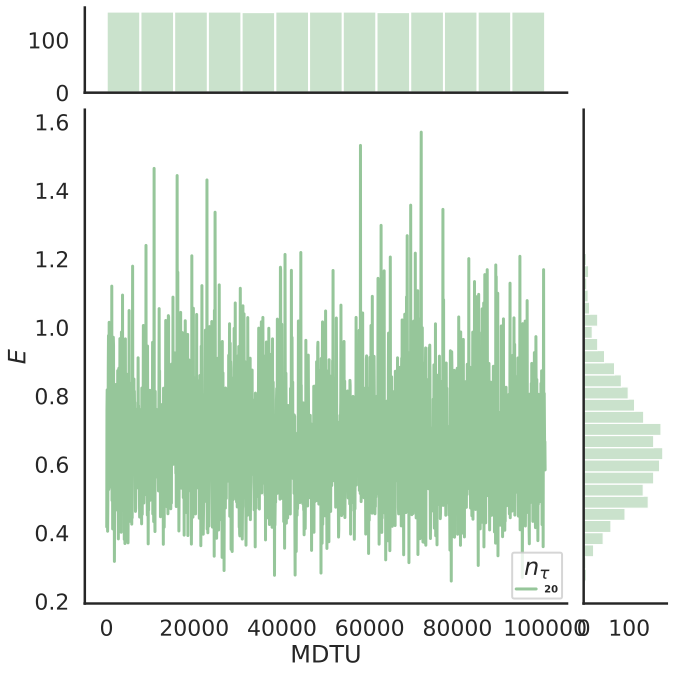
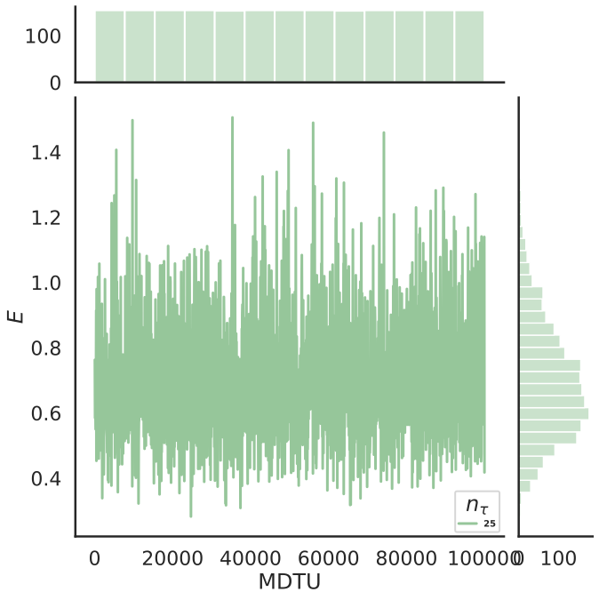
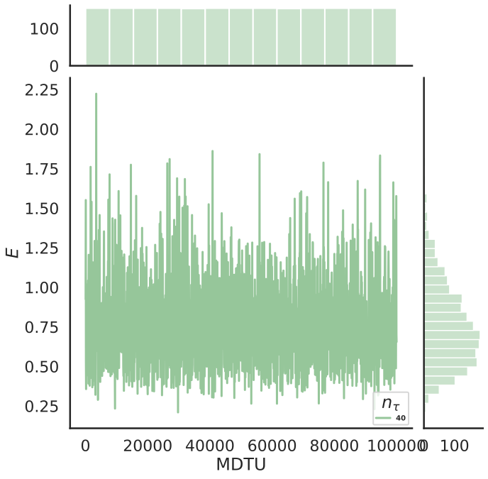
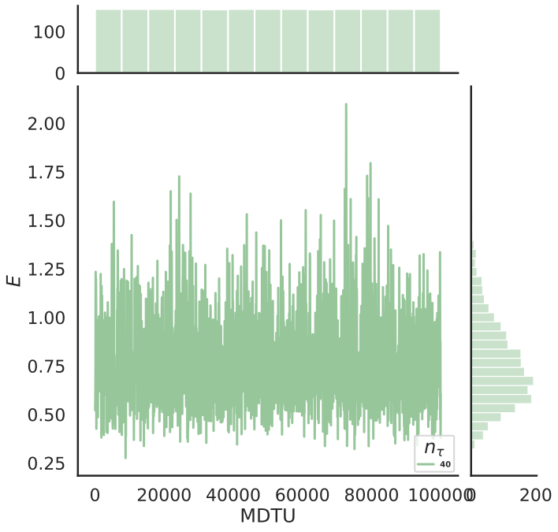
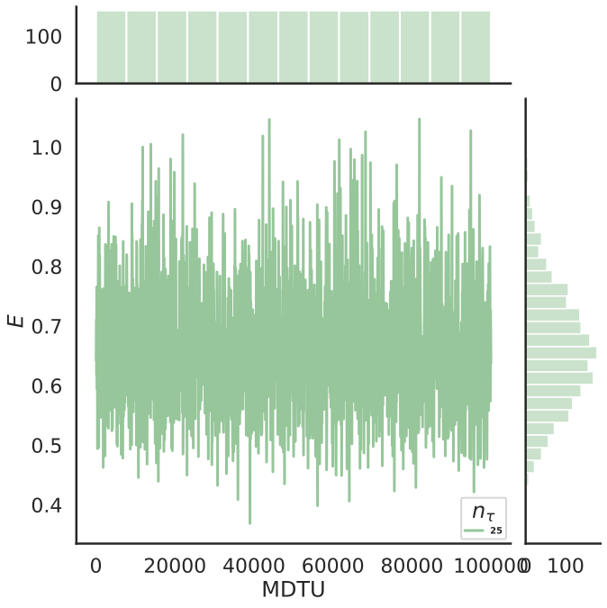
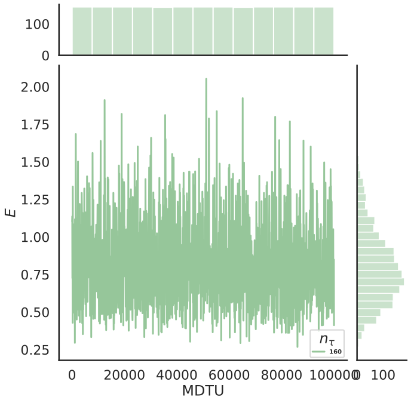

# Figures of the internal energy

The energy $E$ of the ground state as a function of the Monte Carlo molecular dynamics time unit (`MDTU`).
The side panels show the distribution.
When the distribution of the `MDTU` is not uniform during the MCMC run it means that different intervals were used when saving to disk.

The thermalization trajectories are not removed.
The plot legend shows the number of integration steps $n_\tau$ used in the Hybrid Monte Carlo algorithm.

Below we collect all figures of the energy for all the gauge groups, gauge couplings, lattice sizes $n_t$, and temperatures $T$.
# SU(2) 
## $\lambda = 0.5$
### $n_t = 16$
#### $T=0.05$
{loading=lazy width=300}
#### $T=0.1$
{loading=lazy width=300}
#### $T=0.15$
{loading=lazy width=300}
#### $T=0.2$
{loading=lazy width=300}
#### $T=0.25$
{loading=lazy width=300}
#### $T=0.3$
{loading=lazy width=300}
#### $T=0.4$
{loading=lazy width=300}

### $n_t = 24$
#### $T=0.05$
{loading=lazy width=300}
#### $T=0.1$
{loading=lazy width=300}
#### $T=0.15$
{loading=lazy width=300}
#### $T=0.2$
{loading=lazy width=300}
#### $T=0.25$
{loading=lazy width=300}
#### $T=0.3$
{loading=lazy width=300}
#### $T=0.4$
{loading=lazy width=300}

### $n_t = 32$
#### $T=0.05$
{loading=lazy width=300}
#### $T=0.1$
{loading=lazy width=300}
#### $T=0.15$
{loading=lazy width=300}
#### $T=0.2$
{loading=lazy width=300}
#### $T=0.25$
{loading=lazy width=300}
#### $T=0.3$
{loading=lazy width=300}
#### $T=0.4$
{loading=lazy width=300}

### $n_t = 48$
#### $T=0.05$
{loading=lazy width=300}
#### $T=0.1$
{loading=lazy width=300}
#### $T=0.15$
{loading=lazy width=300}
#### $T=0.2$
{loading=lazy width=300}
#### $T=0.25$
{loading=lazy width=300}
#### $T=0.3$
{loading=lazy width=300}
#### $T=0.4$
{loading=lazy width=300}

### $n_t = 64$
#### $T=0.05$
{loading=lazy width=300}
#### $T=0.1$
{loading=lazy width=300}
#### $T=0.15$
{loading=lazy width=300}
#### $T=0.2$
{loading=lazy width=300}
#### $T=0.25$
{loading=lazy width=300}
#### $T=0.3$
{loading=lazy width=300}
#### $T=0.4$
{loading=lazy width=300}

### $n_t = 96$
#### $T=0.05$
{loading=lazy width=300}
#### $T=0.1$
{loading=lazy width=300}
#### $T=0.15$
{loading=lazy width=300}
#### $T=0.2$
{loading=lazy width=300}
#### $T=0.25$
{loading=lazy width=300}
#### $T=0.3$
{loading=lazy width=300}
#### $T=0.4$
{loading=lazy width=300}

### $n_t = 128$
#### $T=0.05$
{loading=lazy width=300}
#### $T=0.1$
{loading=lazy width=300}
#### $T=0.15$
{loading=lazy width=300}
#### $T=0.2$
{loading=lazy width=300}
#### $T=0.25$
{loading=lazy width=300}
#### $T=0.3$
{loading=lazy width=300}
#### $T=0.4$
{loading=lazy width=300}

### $n_t = 196$
#### $T=0.05$
{loading=lazy width=300}
#### $T=0.1$
{loading=lazy width=300}
#### $T=0.15$
{loading=lazy width=300}
#### $T=0.2$
{loading=lazy width=300}
#### $T=0.25$
{loading=lazy width=300}
#### $T=0.3$
{loading=lazy width=300}
#### $T=0.4$
{loading=lazy width=300}

## Energy SU(2) $\lambda = 1.0$

